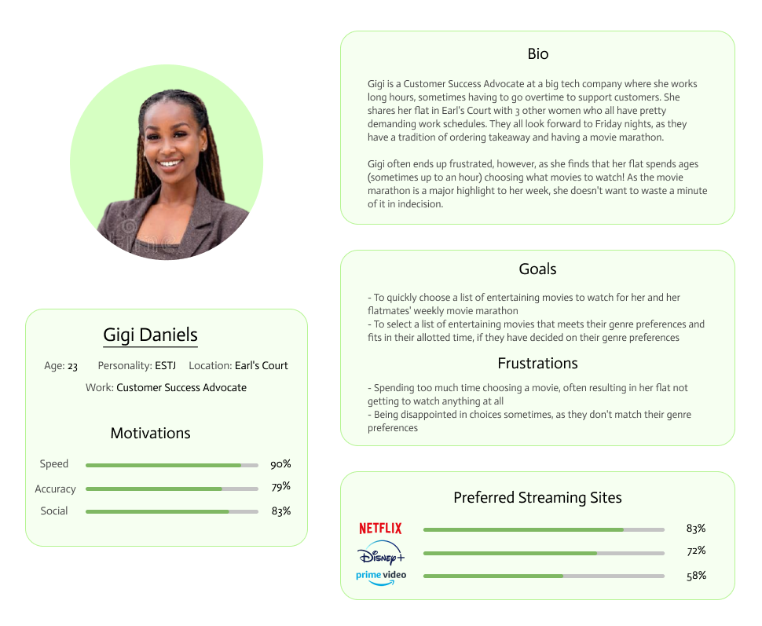

# COMP0035 Coursework 1 

## Select a project methodology

The success of any project, from the simplest problem-solving exercises to the most complex endeavours, is underpinned by the methods used in carrying it out. For this reason, project management has emerged as an up and coming high demand work industry. The most successful teams and businesses value project management and methodology considerations as an unmissable first step to any project undertaking.

Software engineering and data science projects are usually fairly complex and often involve lots of moving parts and dozens of team members all working towards one shared goal. In order to best align these stakeholders, an appropriate project methodology must be chosen and subsequently followed by everyone involved. And in order to do that, the team's project manager (usually someone who has expert knowledge of the target domain, as well as project management experience) must analyse and carefully consider a project's requirements against the strengths of a number of existing project methodologies.

For this project, our team will be working with a dataset from the BFI, to address the following problem statement:
> *The excessive amount of time it takes to pick what movies to watch often results in viewers wasting the majority of their leisure time by spending it looking for something to watch.*

The **Data-driven Scrum** method (an Agile framework optimised for data science teams which integrates elements of Scrum and Kanban) stands out as the most suitable methodology for the project at hand. Given my experience using Scrum in numerous projects undertaken during internships and summer work in the past, I'm highly familiar with the way it works and felt that it permits the iteration and flexibility this project might need due to its short timeframe and its inherent volatility (due to the ever-changing climate of the film industry). The Data-driven Scrum method permits all the benefits of the traditional Scrum method, but with some added functionality:

1. **Variable length duration**: allows more flexibility for teams who mispredict the duration of certain tasks. The traditional Scrum method has fixed sprint lengths
2. **Reviews on an As and When basis**: project retrospectives and item reviews happen as frequently as the team would like, as opposed to happening at the end of each iteration like in traditional Scrum
3. **Collective analysis**: the entire project team contributes to any hypothesis analysis efforts - the onus doesn't fall solely on the product owner to analyse ideas which means this analysis can benefit from team members' aggregate technical expertise.

## Defining the Business Need

In order to define the business need, given the fact that my dataset quantifies information to do with the film industry, I decided to first think about my needs and wants, as a movie-viewer.

Although I am an avid cinemagoer, my most common avenue for filmwatching is through online streaming platforms; specifically Netflix. The platform does a great job at simplifying the movie-viewing experience by providing viewers with everything they need from the comfort of their home. However, all of the benefits Netflix offers end up going to waste when a viewer is left stumped in the process of choosing a movie. This phenomenon, termed "choice fatigue" by the Wall Street Journal, is widespread across the internet community; as such, it provides a huge gap for new business development.

### Problem Statement

Netflix recently delivered a new feature "Play Something" which aims to address this issue. However it doesn't take any user input (such as questions like "movie or TV show?", "what genre?") into consideration before making a choice. This means there's an extremely high probability that the choice made by Netflix won't be something the viewer wants to watch, meaning their choice fatigue will be left unalleviated. I believe the following problem statement clearly elaborates the problem at hand, which will permit the development of a more effective solution to address it:

> *The excessive amount of time it takes to pick what movies to watch often results in viewers wasting the majority of their leisure time by spending it looking for something to watch.*

### Target Audience

As this problem is widespread across Netflix users, our target audience should align closely with that of the platform. According to the Consumer & Media View Survey carried out by Nielsen in 2015, approximately 89% of Netflix users are young adults (aged 18-24), with a large skew aged between 25-39.

The following user persona exemplifies the target audience further:

### The Product Solution

To address this problem, I suggest a solution which requests the user input of their movie genre preferences and time they have set aside for watching and returns a list of movies to match. However, if a user is really stumped for choice and has no genre preferences nor time limit, the app will show them a data visualisation highlighting the genres they are most likely to find entertaining and prompt them again for their genre preferences. In response, users can either select one of these genres and be shown a list of movies that match or they can decline to choose (by pressing the "Choose for me" button); in this case, the web-app would make a random selection of movies and visualise their entertainment value.

In line with our target audience's preference for internet streaming, the solution should come in the form of a web-app to maintain the same level of convenience Netflix users are used to in their streaming experience.

To ensure the solution is effective at solving the problem at hand, I suggest focusing on addressing the following data-focused questions. In brackets I also describe the statistical processes that could be used to solve each of these questions, using our data:

- *What combination of movies is the most entertaining to a user given specific preferences (their preferred genres & the ideal maximum length of marathon)?* - **Recommendation**
- *Is there a correlation between movie genre and movie popularity? What are the most popular movie genres?* - **Regression**
- *What are the most popular movies within each genre?* - **Regression**
- *Which movies fit into the category of the genres they'd like to watch?* - **Classification**
- *How many movies of this genre can they fit into their allotted marathon time?* - **Summation**

## Data exploration and preparation

For this project, I've been working with two datasets: 

1. **The British Film Institute (BFI) data** which provides a report on the top 15 most popular movies at the Box Office, their gross box office revenue and some related statistics (e.g. how many weeks they've spent on the Box Office charts, their cumulative revenue etc.)
2. **The Movie Database (TMDB) data** which is an enormous community-built database containing an extensive set of data on almost 1 million movies. For developers, any data you need from TMDB can be requested using their API. 

### Data Preparation steps

To format their data, filter out irrelevant datapoints and merge these two datasets, I wrote a [data preparation script](data_preparation.py). Here's a breakdown of the steps I followed to write the code, and consequently prepare my data for exploration.

- To begin with, I thought about how I could put the two databases together. In order to request data from the TMDB database, I needed a list of movies. So I decided I would need to use the BFI data to effectively make a list of movies, then after that, I would iterate through this list to request the TMDB data I needed for each movie. 

#### Preparing the BFI Movie list

- I started off by downloading the 2001 to 2006 BFI xlsx files from their [website](https://www.bfi.org.uk/industry-data-insights/weekend-box-office-figures) and uploading them to my Google Drive. The files were formatted such that they had their data broken up into different worksheets for every month. I manually imported each worksheet into the first, leaving me with one worksheet per file which contained all the data for the year. 

- I downloaded all 6 files as csv's and moved them to my Coursework 1 folder, the current directory. The files are named as follows: [2001_single_sheet.csv](2001_single_sheet.csv), [2002_single_sheet.csv](2002_single_sheet.csv), [2003_single_sheet.csv](2003_single_sheet.csv), [2004_single_sheet.csv](2004_single_sheet.csv), [2005_single_sheet.csv](2005_single_sheet.csv), [2006_single_sheet.csv](2006_single_sheet.csv),

- On a piece of paper I then jotted down a rough code flowchart of the processes that needed to happen in order to prepare the BFI data. It looked like this

- I then thought of these steps in terms of functions and described what they each did, and their input and output on a piece of paper. The functions were **import_datasets**, **remove_extras**, **write_to_csv** and **remove_repeats**. You can read about what each of the functions does by hovering over it in [the data preparation script](data_preparation.py).

- After that, I got started writing the code. I wrote the code function by function and tested each function using some edits to the main function. Once I was satisfied with the function, I moved onto the next one and commented out its test code from main. I also created a [new csv file](prepared_BFI.csv) to write the prepared BFI data to.

- When I was done writing the code to prepare the BFI data, I ran it. Once it had run, I checked the [prepared BFI data file](prepared_BFI.csv) to verify that the data looked the way I expected it to.

#### Bringing in the TMDB data

- Once the BFI data was prepared, I started thinking about how I would get the TMDB data for each movie.

- I started by reading the TMDB API documentation and making note of the requests I would need to get the data I wanted. I only needed two: (1) [Search and Query](https://developers.themoviedb.org/3/getting-started/search-and-query-for-details) to find the TMDB movie ID for each of the BFI movies, and (2) [Get Details](https://developers.themoviedb.org/3/movies/get-movie-details) which can only be accessed using the movie ID. I wanted to get more data for each movie (I was looking for the genre, popularity, runtime and vote_average information for each movie).

- I broke the task down function by function, making notes on what functions I would need to pull in the TMDB data and subsequently prepare it. The functions were **search_and_query**, **write_file_ID**, **get_details** and **write_file_details**. I made them all subfunctions by wrapping them in a bigger function **concat_tmdb** to simplify the code I'd have to write in main. This function called on all its subfunctions and cleaned up the data that was output before writing it in a [new csv file](prepared_complete_data.csv). Check out the functions in [the data preparation script](data_preparation.py) to learn more about how they all work.

- I wrote the code for each function. The first one was the hardest as I had never made an API request before, so it took me a short while to familiarise myself with how they work and how to convert the output from JSON to a string.

- Like with the BFI prep code, I tested the functions regularly. I made [the new csv file](prepared_complete_data.csv) to write the merged BFI and TMDB data to.

- When I was done writing all the functions, I wrote a function call in main. I also made a variable called sampleList which was a sample list of movies (it only had about 5 movies in it). I ran the completed [data_preparation.py](data_preparation.py) file such that it would iterate over sampleList as opposed to the [huge list of 1424 movies](prepared_BFI.csv) I made using the BFI data.

- I checked the [prepared_complete_data.csv](prepared_complete_data.csv) file to confirm that the TMDB functions behaved as expected and that they merged with the BFI data the way I wanted.

- Once I was satisfied with my testing, I commented out the sampleList variable and ran [data_preparation.py](data_preparation.py) on the the huge list of movies. It goes without saying that I had to fix some bugs at this stage (as I did at every stage), but it managed to run.

#### Findings and Adjustments from Data Preparation

- However, I was surprised to see that the [prepared_complete_data.csv](prepared_complete_data.csv) file only had about 400 movies while the [prepared_complete_data.csv](prepared_BFI.csv) file had over 1400. 

- I realised that a lot of movies had been removed due to having missing data. The issue mainly came from the **Genre 3** and **Average Vote** columns - I originally had the **write_file_details function** look for three genres for each movie, as well as the other information mentioned in the **"Bringing in the TMDB data"** section.

- I changed the **write_file_details** function so that it would only look for two genres for each movie, and removed 'vote_average' from the list of relevantDetails it looked for. Upon rerunning the code, I was pleased to see that the [prepared_complete_data.csv](prepared_complete_data.csv) had hundreds more movies than it did previously

- Ultimately, I decided to return 'vote_average' to the list of relevantDetails as I hoped to use it during the data exploration stage of the project, to compare each movie's statistics for Average Vote against its Popularity. However, I kept it such that the **write_file_details** function continued to only look for two genres per movie.

### Data Preparation steps

#### Code

#### Findings and Adjustments from Data Exploration
